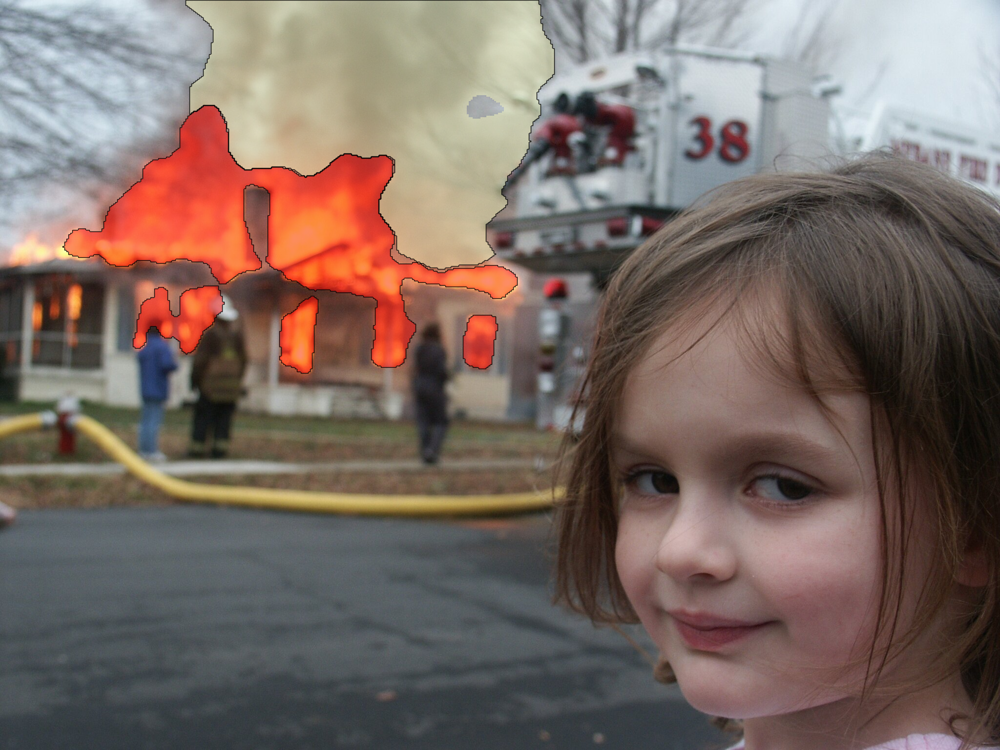

# Gist

Segmentation U-net trained for extracting fire and smoke from images.

### Samples

<p align="center">
  
  
</p>

### Train

Download [fire and smoke segmentation dataset](https://universe.roboflow.com/zd7y6xooqnh7wc160ae7/fire-and-smoke-segmentation).

Generate masks:

`python coco_to_masks.py`

Move images to `[train|valid|test]/images/` respectively:

`mkdir images; mv *.jpg images`

Final structure:

```
fire_dataset/
├── test/
│   ├── images/
│   ├── masks/
├── train/
│   ├── images/
│   ├── masks/
├── valid/
│   ├── images/
│   ├── masks/
├── README.dataset.txt
└── README.roboflow.txt
```

Train:

`python train.py`

### Test

`python test.py --image fire_girl.jpg --weights best_unet.pth`
